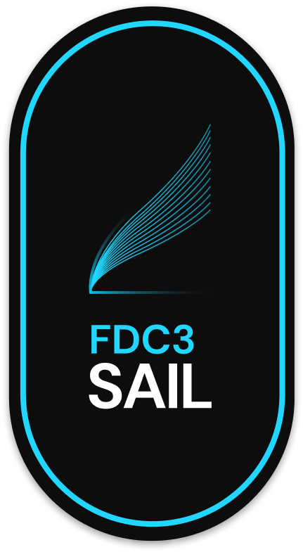

<p align="center">
    
</p>

<h1 align="center">FDC3 Sail</h1>

<h3 align="center">Develop easier. &nbsp; Build faster. &nbsp; Integrate quicker.</h3>

<br />

<div align="center">

[](https://finosfoundation.atlassian.net/wiki/display/FINOS/Incubating)
[](https://github.com/finos/fdc3-sail/blob/main/LICENSE)

[](https://github.com/finos/fdc3-sail)

<br />

[](https://github.com/finos/FDC3-Sail/actions/workflows/ci.yml)
[](https://bestpractices.coreinfrastructure.org/projects/12272)
[](https://scorecard.dev/viewer/?uri=github.com/finos/FDC3-Sail)
[](https://github.com/finos/FDC3-Sail/actions/workflows/semgrep.yml)
[](https://github.com/finos/FDC3-Sail/actions/workflows/ql.yml)
[](https://github.com/finos/FDC3-Sail/actions/workflows/cve-scanning.yml)

</div>

## What is FDC3 Sail?

If you are new to FDC3, start with the [FDC3 website](https://fdc3.finos.org).

FDC3 Sail is a fully open source implementation of the [FDC3](https://fdc3.finos.org) interoperability standard. It provides:

- A **pure, transport-agnostic FDC3 Desktop Agent** (`@finos/sail-desktop-agent`) that runs in any JavaScript environment
- A **browser-based deployment** (`sail-web`) where the Desktop Agent runs inside a browser tab and manages FDC3 apps in iframes
- An **Electron desktop deployment** (`sail-electron`) for a native desktop app experience
- A **platform SDK** (`@finos/sail-platform-api`) with middleware, app launcher, and Sail-specific integrations
- A **shared UI component library** (`@finos/sail-ui`) built with React and shadcn/ui

## Architecture

FDC3 Sail uses a clean two-layer architecture separating the pure FDC3 logic from deployment concerns:

```
┌─────────────────────────────────────────────────────────────────────────┐
│  FDC3 Apps (iframes / windows)                                          │
│  Connect via @finos/fdc3-get-agent (WCP)                                │
│  fdc3.raiseIntent(), fdc3.broadcast(), fdc3.getInfo(), etc.             │
└────────────────────────────────┬────────────────────────────────────────┘
                                 │ Web Connection Protocol (WCP)
                                 ▼
┌─────────────────────────────────────────────────────────────────────────┐
│  WCPConnector  (@finos/sail-desktop-agent/browser)                      │
│  - Handles WCP1–6 handshake with iframe apps                           │
│  - Manages per-app MessagePorts                                         │
│  - Bridges to the Transport layer                                       │
└────────────────────────────────┬────────────────────────────────────────┘
                                 │ Transport (swappable)
                                 ▼
┌─────────────────────────────────────────────────────────────────────────┐
│  DesktopAgent  (@finos/sail-desktop-agent)                              │
│  - Pure FDC3 2.2 logic, zero environment dependencies                  │
│  - DACP message handlers (intents, channels, open, findInstances…)     │
│  - State registries: app instances, channels, intent listeners          │
└─────────────────────────────────────────────────────────────────────────┘
```

### Packages

| Package | Description |
|---|---|
| [`packages/sail-desktop-agent`](packages/sail-desktop-agent/) | Pure FDC3 Desktop Agent — environment-agnostic core |
| [`packages/sail-platform-api`](packages/sail-platform-api/) | Platform SDK — Sail middleware, app launcher, integrations |
| [`packages/sail-ui`](packages/sail-ui/) | Shared React UI component library |

### Apps

| App | Description |
|---|---|
| [`packages/sail-web`](packages/sail-web/) | Browser deployment — React app hosting the Desktop Agent |
| [`packages/sail-electron`](packages/sail-electron/) | Electron deployment — native desktop wrapper |

Documentation lives at **[https://finos.github.io/FDC3-Sail/docs/](https://finos.github.io/FDC3-Sail/docs/)** (built from [`website/`](website/) via GitHub Pages).

## Prerequisites

- **Node.js** >= 24.x
- **npm** >= 11.x

## Quick Start

### Clone the Repository

```bash
git clone https://github.com/finos/FDC3-Sail.git
cd FDC3-Sail
npm install
```

### Running the Browser App

```bash
npm run dev
```

Open http://localhost:3000 in your browser. FDC3 apps loaded in iframes will connect automatically via WCP.

### Running the Electron Desktop App

```bash
npm run dev:desktop
```

The Electron window will open and connect to the local web server.

## Development

### Build All Packages

```bash
npm run build
```

### Run All Tests

```bash
npm test
```

### Type Check

```bash
npm run typecheck
```

### Lint and Format

```bash
npm run lint
npm run format
```

### Regenerating FDC3 Schemas

Sail validates all FDC3 Desktop Agent Communication Protocol (DACP) messages using Zod schemas auto-generated from the official FDC3 JSON schemas.

**When to regenerate schemas:**
- After updating the `@finos/fdc3-schema` package
- When the FDC3 specification is updated
- When adding support for new DACP message types

**To regenerate schemas:**

```bash
npm run generate:schemas --workspace=@finos/sail-desktop-agent
```

The generated file (`packages/sail-desktop-agent/src/handlers/validation/dacp-schemas.ts`) should not be edited manually.

## Package Documentation

- [`sail-desktop-agent` README](packages/sail-desktop-agent/README.md) — FDC3 DA API, subpath exports, transport interface
- [`sail-platform-api` README](packages/sail-platform-api/README.md) — Middleware, app launcher, Sail platform integrations
- [`sail-ui` README](packages/sail-ui/README.md) — Shared React UI components

## npm packages

Publishable libraries use **per-package git tags** (independent release cycles):

```bash
# 1. Bump version in packages/sail-desktop-agent/package.json
git tag @finos/sail-desktop-agent@3.0.0-pre.1.0
git push origin @finos/sail-desktop-agent@3.0.0-pre.1.0
```

Tag format: `@finos/<package-name>@<semver>`. Supported today: `@finos/sail-desktop-agent`, `@finos/sail-platform-api`. Requires repo secret `NPM_TOKEN`.

## Meetings

FDC3 Sail holds regular project meetings to discuss development progress, roadmap, and community contributions.

- [Join FDC3 Sail Meeting](https://zoom-lfx.platform.linuxfoundation.org/meeting/95252800112?password=90638454-991c-4ab0-8aed-791fc372623c)
- [Register for the meeting series (calendar invite)](https://zoom-lfx.platform.linuxfoundation.org/meeting/95252800112?password=90638454-991c-4ab0-8aed-791fc372623c&invite=true)

Meeting agendas and minutes are tracked through GitHub issues with the `meeting` label.

## Status

FDC3 Sail targets full [FDC3 2.2](https://fdc3.finos.org/docs/api/spec) conformance. It is currently in active development and **not yet ready for production use**. Contributions and bug reports are welcome.

## Mailing List

To join the FDC3 Sail mailing list please email [fdc3-sail+subscribe@lists.finos.org](mailto:fdc3-sail+subscribe@lists.finos.org).

## Other FDC3 desktop agents

FDC3 is an open standard; other desktop agents are listed on the [FDC3 website](https://fdc3.finos.org). Sail is one open-source implementation — you can use another agent with the same FDC3 apps where supported.

## Contributing

1. Fork it (<https://github.com/finos/fdc3-sail/fork>)
2. Create your feature branch (`git checkout -b feature/fooBar`)
3. Read our [contribution guidelines](CONTRIBUTING.md) and [Community Code of Conduct](https://www.finos.org/code-of-conduct)
4. Commit your changes (`git commit -am 'Add some fooBar'`)
5. Push to the branch (`git push origin feature/fooBar`)
6. Create a new Pull Request

_NOTE:_ Commits and pull requests to FINOS repositories will only be accepted from those contributors with an active, executed Individual Contributor License Agreement (ICLA) with FINOS OR who are covered under an existing and active Corporate Contribution License Agreement (CCLA) executed with FINOS. Commits from individuals not covered under an ICLA or CCLA will be flagged and blocked by the FINOS Clabot tool (or [EasyCLA](https://github.com/finos/community/blob/master/governance/Software-Projects/EasyCLA.md)). Please note that some CCLAs require individuals/employees to be explicitly named on the CCLA.

_Need an ICLA? Unsure if you are covered under an existing CCLA? Email [help@finos.org](mailto:help@finos.org)_

### Emeritus contributors

- [Nick Kolba](https://github.com/nkolba) contributed the first version of FDC3-Sail, initially called "FDC3 Electron", in 2022.
- [Seb M'Barek](https://github.com/sebbenmbarek) and Nick Kolba renamed the project to FDC3-Sail and presented it at [OSFF New York in 2023](https://www.youtube.com/watch?v=dKDkOk3btWU).

## License

Copyright 2022–2026 [FINOS](https://www.finos.org/)

Distributed under the [Apache License, Version 2.0](http://www.apache.org/licenses/LICENSE-2.0).

SPDX-License-Identifier: [Apache-2.0](https://spdx.org/licenses/Apache-2.0)
