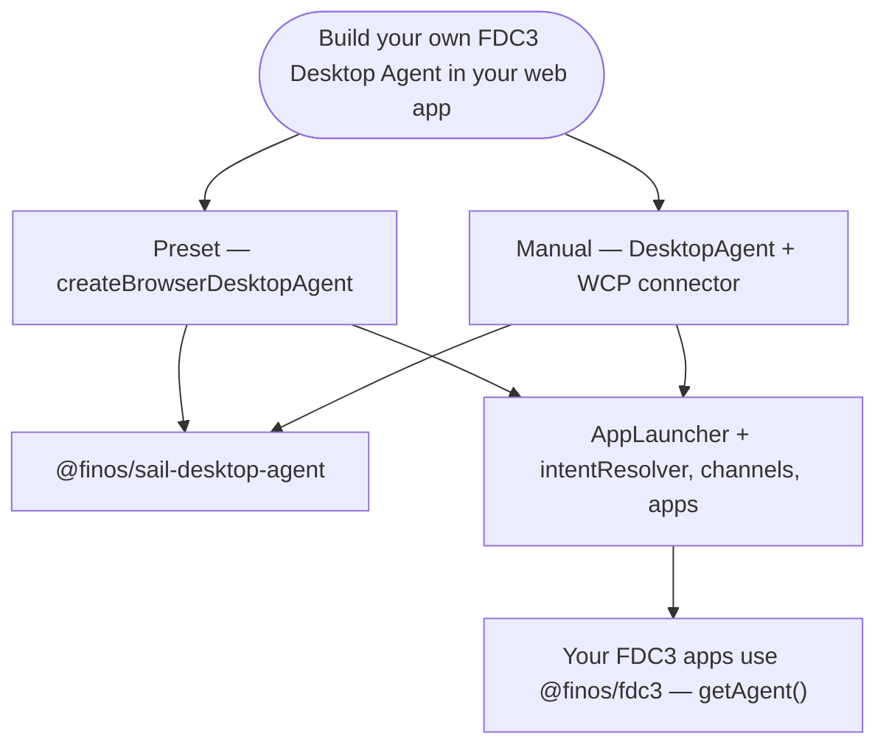
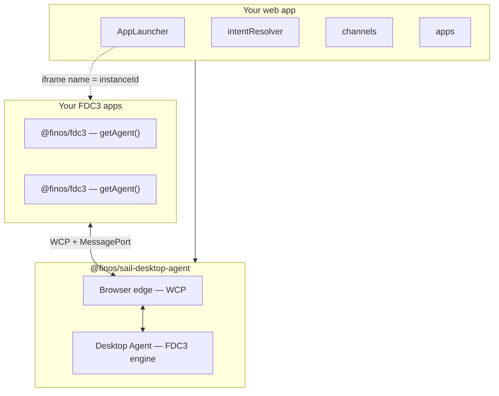

# Getting Started

Use this guide when you want to **build your own FDC3 Desktop Agent inside your web application** — your UI, your layout, your branding — while Sail provides the FDC3 engine and browser connection layer.

If you prefer to **run the full Sail platform** without building a custom host, see [Run Sail](./run-sail) instead.

If you want to **clone the monorepo and contribute**, see the [Development Guide](./development).

If you are an **application developer** trying to make an existing web app run in Sail, start with [Add your app to Sail](./add-your-app) instead.

## Choose your integration path

Both paths below use **`@finos/sail-desktop-agent`** from npm. The difference is how much wiring you do yourself.



| Path | When to use | npm entry |
|------|-------------|-----------|
| **Preset** | Most custom hosts — browser edge and Desktop Agent wired for you | `createBrowserDesktopAgent` from `@finos/sail-desktop-agent/presets` |
| **Manual** | Custom transports, remote Desktop Agent, or full control of lifecycle | `DesktopAgent`, `WCPConnector` from `@finos/sail-desktop-agent` |

For composition diagrams, WCP handshake detail, and sequence flows, see the [integrator guide](./packages/desktop-agent/integrator-guide) and [composition reference](./packages/desktop-agent/composition).

## How `getAgent()` reaches Sail

FDC3 for the web is different from container environments that inject a Desktop Agent API directly into every app window. In a browser-resident Sail host, apps normally use the standard `@finos/fdc3` `getAgent()` function. That function discovers a Desktop Agent by looking for one of the web mechanisms defined by FDC3:

| App location | Standard `getAgent()` discovery | Sail browser support |
|--------------|----------------------------------|----------------------|
| App loaded in a host iframe | The app posts `WCP1Hello` to parent windows; Sail answers from the host window with `WCP3Handshake` and a `MessagePort`. | Supported and used by `sail-web`. |
| App opened as a child window | The app can post `WCP1Hello` to `window.opener` if the opener relationship is preserved. | Supported by the protocol layer; custom hosts must implement the window-launching `AppLauncher`. |
| App in a traditional preload/container environment | `getAgent()` can return `window.fdc3` when the container injects it. | Not the default browser host path. |
| React component in the same top-level page as the Sail host | There is no parent or opener for `getAgent()` to discover, and Sail does not currently install a top-level `window.fdc3` preload object. | Use `SailPlatform` / host APIs directly, or isolate the app in an iframe/window. |

In other words: apps that want the standard FDC3 web client should run in their own browsing context, usually an iframe. Same-page React components are host UI, not independent FDC3 app instances, unless you build a separate adapter for them.

That boundary is also what makes Sail work well as a micro-frontend host. Each app can be built by a different team, deployed from a different URL, and written with a different framework. Sail does not care whether an iframe contains React, Vue, Angular, Svelte, or plain JavaScript; it only needs the app to use `@finos/fdc3` and match an app directory entry.


Same-page framework components are different. A host page can technically expose a single `window.fdc3` object, but all components in that page would share the same global object, browsing context, and app identity unless Sail added a custom component-level identity layer. That is useful for host chrome, but it is not the standard FDC3 for-the-web model for independent apps.

## Prerequisites

- Node.js **24+** (for local development and building Sail itself)
- A bundler targeting modern browsers (Vite, webpack, etc.)
- FDC3 web applications that use `@finos/fdc3`

## Install

```bash
npm install @finos/sail-desktop-agent @finos/fdc3
```

The desktop agent package exposes several entry points:

| Import | Purpose |
|--------|---------|
| `@finos/sail-desktop-agent` | Core types, `DesktopAgent`, host contracts |
| `@finos/sail-desktop-agent/presets` | `createBrowserDesktopAgent` and other presets |
| `@finos/sail-desktop-agent/browser` | `WCPConnector` and browser edge |
| `@finos/sail-desktop-agent/transports` | `InMemoryTransport`, transport helpers |

## Path 1 — Preset (`createBrowserDesktopAgent`)

The preset couples the **browser edge** (WCP, MessagePort per app) and **Desktop Agent** (FDC3 logic) in one process. You implement **`AppLauncher`** (iframe/window creation) and wire host shell UI through the grouped controllers on the preset handle.

```typescript
import { createBrowserDesktopAgent } from "@finos/sail-desktop-agent/presets"
import type { AppLauncher } from "@finos/sail-desktop-agent"

const appShell = document.getElementById("app-shell")!

const appLauncher: AppLauncher = {
  async launch(request, app) {
    const instanceId = request.app?.instanceId ?? crypto.randomUUID()
    const iframe = document.createElement("iframe")
    iframe.name = instanceId // must match WCP identity
    iframe.src = app.type === "web" ? (app.details?.url as string) : ""
    appShell.appendChild(iframe)
    return { appId: app.appId, instanceId }
  },
  async close(instanceId) {
    appShell.querySelector(`iframe[name="${instanceId}"]`)?.remove()
  },
}

const desktopAgent = createBrowserDesktopAgent({ appLauncher })
const { intentResolver, channels, apps } = desktopAgent

await apps.addDirectory("/apps.json")

intentResolver.onRequest(async request => {
  const picked = await showIntentPicker(request.handlers) // your UI
  if (picked) intentResolver.select(request.requestId, picked)
  else intentResolver.cancel(request.requestId)
})

channels.onAppChannelChange(({ instanceId, channelId }) => {
  updateChannelChrome(instanceId, channelId)
})

apps.onConnect(meta => console.log("connected", meta.appId))
apps.onDisconnect(instanceId => {
  appShell.querySelector(`iframe[name="${instanceId}"]`)?.remove()
})

// Edge starts with the agent — apps can await fdc3.getAgent()
```

**FDC3 boundary:** apps use `@finos/fdc3` `getAgent()` inside iframes; host shell code uses Sail preset controllers (`intentResolver`, `channels`, `apps`).

Copy-paste examples, unsubscribe patterns, and lifecycle teardown are in the [integrator guide](./packages/desktop-agent/integrator-guide).

## Path 2 — Manual (`DesktopAgent` + connectors)

Use manual composition when you need a **non-default transport** (remote Desktop Agent on a server or worker), custom edge lifecycle, or you are authoring a framework on top of Sail.

```typescript
import { DesktopAgent } from "@finos/sail-desktop-agent"
import { WCPConnector } from "@finos/sail-desktop-agent/browser"
import { createInMemoryTransportPair } from "@finos/sail-desktop-agent/transports"

const [agentTransport, edgeTransport] = createInMemoryTransportPair()

const desktopAgent = new DesktopAgent({
  transport: agentTransport,
  appDirectories: ["/apps.json"],
  appLauncher: myAppLauncher,
})

const wcpConnector = new WCPConnector({
  transport: edgeTransport,
  appLauncher: myAppLauncher,
})

await desktopAgent.start()
wcpConnector.start()
```

See [composition & internals](./packages/desktop-agent/composition) for the layered model and remote-DA pattern (`createWCPClient`).

## Host contracts — what you must provide

When you embed a Desktop Agent, **your web application** owns the shell UI. Sail defaults to **host-owned** intent and channel UI (not iframe injection into each app).

| Contract | Required? | Your responsibility |
|----------|-----------|---------------------|
| **`AppLauncher`** | **Yes** | Create the iframe (or window) when FDC3 `open()` runs; set `iframe.name` to the instance id; optional `close` for FDC3 v3.0 `fdc3.close()` |
| **App catalog** | **Yes** | `apps.addDirectory` / `apps.add` at runtime (or constructor `appDirectories` / `apps`) |
| **Intent resolver UI** | When multiple handlers match | `intentResolver.onRequest` / `select` / `cancel` on the preset handle |
| **Channel UI** | Recommended | `channels.getUserChannels`, `channels.changeAppChannel`, `channels.onAppChannelChange` |
| **Instance lifecycle** | Recommended | `apps.onConnect` / `onDisconnect` / `onHandshakeFailure`; host tab close via `apps.disconnect` |

FDC3 also allows **WCP3 iframe injection** for intent resolver and channel selector pages inside the app window (`wcpOptions.intentResolverUrl` / `channelSelectorUrl`). Sail and the browser preset default to host-owned UI instead. See [integrator guide — wiring intent and channel UI](./packages/desktop-agent/integrator-guide#wiring-intent-resolver-and-channel-selector-ui).

### Composition at a glance



## Connecting your FDC3 apps

Whether you **run the full Sail platform** ([Run Sail](./run-sail)) or **embed your own Desktop Agent** (this guide), application code is the same.

FDC3 applications depend on the standard client library:

```bash
npm install @finos/fdc3
```

Inside each app, after the host has loaded it in its iframe or child window:

```typescript
import { fdc3 } from "@finos/fdc3"

const agent = await fdc3.getAgent()

// Example: join a user channel
await agent.joinUserChannel("fdc3.channel.1")

// Example: broadcast context
await agent.broadcast({
  type: "fdc3.instrument",
  id: { ticker: "AAPL" },
})
```

The host's Desktop Agent completes the WCP handshake with the app; `@finos/fdc3` handles connection details. Apps do not import `@finos/sail-desktop-agent` unless they are also acting as a host.

For app developers, the important rule is simple: write against `@finos/fdc3`, list the app URL in the host app directory, and let the Sail host load the app. Do not reach into the parent frame or import Sail internals from app code.

## Advanced — platform API without sail-web

Most embedders use **`@finos/sail-desktop-agent` only**. If you need Sail **workspace, layout, and config** APIs without the full `sail-web` UI, see [@finos/sail-platform-api](./packages/platform-api/overview) (`SailPlatform`). The full Sail platform uses this layer internally; you only need it when building a custom platform shell that is not covered by the preset.

## Next steps

- [Integrator guide](./packages/desktop-agent/integrator-guide) — primary reference for browser hosts
- [Add your app to Sail](./add-your-app) — app developer onboarding
- [Composition & internals](./packages/desktop-agent/composition) — diagrams and module interaction
- [@finos/sail-desktop-agent overview](./packages/desktop-agent/overview)
- [Architecture overview](./architecture/overview)
- [Run Sail](./run-sail) — full platform instead of custom embed
- [Development Guide](./development) — contribute to Sail source
