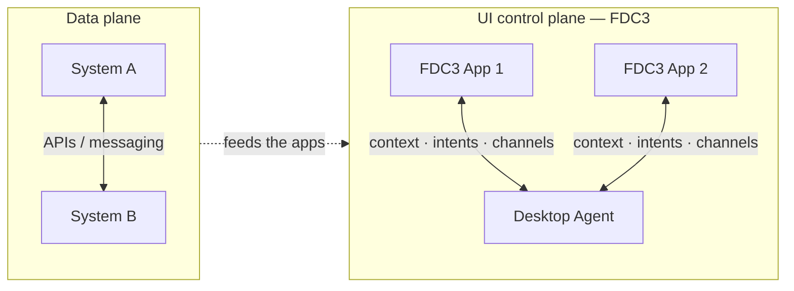
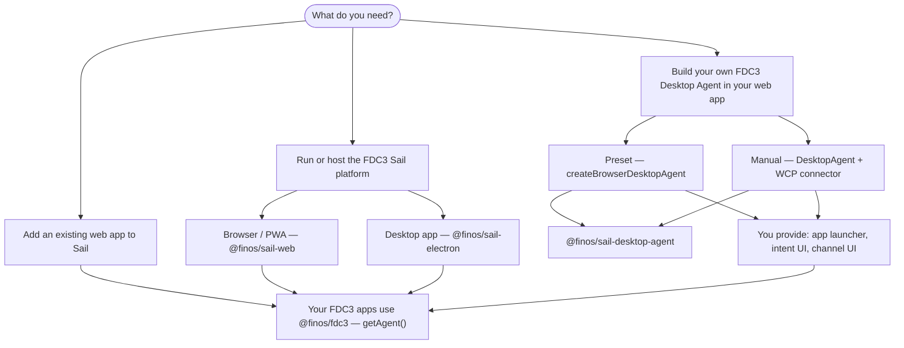

# Introduction

Financial and enterprise users rarely work in a single application. They move between pricing tools, order entry, portfolio views, research, and CRM — copying identifiers, re-keying context, and switching windows. **Interoperability** is what removes that friction: connected applications share context and actions so the user stays in flow, makes fewer mistakes, and finishes tasks faster.

**[FDC3](https://fdc3.finos.org/)** (Financial Desktop Connectivity and Collaboration Consortium) is an open FINOS standard for **UI-level interoperability**. It defines how applications on a desktop or in a browser discover each other, share **context** (for example an instrument or portfolio), raise **intents** (“show this chart for this symbol”), and link via **channels** — without each vendor building bespoke integrations pairwise.

**FDC3 Sail** is the open-source implementation of [FDC3 2.2](https://fdc3.finos.org/docs/api/spec) and [FDC3 For-The-Web](https://fdc3.finos.org/docs/api/specs/browserResidentDesktopAgents) in this repository. It provides a **Desktop Agent** (the FDC3 engine), a **browser connection layer** (WCP), and optional **platform UI** (web and Electron) so you can run or embed a standards-compliant FDC3 host.

## UI control plane vs data plane

Most integration effort in large organisations goes into the **data plane** — APIs, messaging, ETL, and services that move business data between systems (prices, orders, positions, reference data).

FDC3 addresses the **UI control plane** — how applications **on the user's desktop or browser** coordinate with each other:

| Plane | What it connects | Typical examples |
|-------|------------------|------------------|
| **Data plane** | Back-end systems and services | REST APIs, Kafka, FIX, data warehouses |
| **UI control plane** | End-user applications in a workspace | Context share, intents, channels, app directory |

These are **complementary**, not competing. A trade might flow through the data plane while the user experience is orchestrated through the UI control plane — select an instrument in one app and linked apps update instantly, without custom glue code for every app pair.

FDC3 Sail implements the **Desktop Agent** and host wiring for the UI control plane. Your FDC3 applications use the standard [`@finos/fdc3`](https://www.npmjs.com/package/@finos/fdc3) library and `getAgent()` — the same API regardless of which Sail path you choose.

## Is FDC3 Sail right for you?

FDC3 Sail is a **good fit** if you:

- Need a **browser or Electron FDC3 host** aligned with FDC3 2.2 and For-The-Web
- Want an **open-source** stack you can run, host, embed, or extend
- Have (or plan) **FDC3-compliant web applications** that call `fdc3.getAgent()`
- Prefer standards-based interoperability over one-off app-to-app integrations

Consider alternatives or additional work if you:

- Only need back-end system integration with no linked UI (data plane only)
- Require a mature vendor desktop with long-term support contracts today — evaluate Sail against your risk tolerance; the project is actively evolving with the standard
- Need **enterprise packaging** out of the box (SSO, MDM distribution, hardened installers, multi-tenant ops) — Sail is **production-ready** for running FDC3 workloads, but **organisational deployment and governance** remain your integration work

## Status

FDC3 Sail is a **production-ready product** for hosting FDC3 applications. It implements FDC3 2.2 (DACP, WCP) and works with the standard `@finos/fdc3` client library unchanged. Packaging Sail as an **enterprise system** — identity, deployment pipelines, operational monitoring, and IT policy — is a separate layer of work for your organisation.

## Choose your path

Where you go next depends on what you are building:

| I want to… | Go to |
|------------|--------|
| **Add an existing web app to Sail or another FDC3 Desktop Agent** | [Add your app to Sail](./add-your-app) |
| **Run or host the full FDC3 Sail platform** (browser or desktop, minimal custom code) | [Run Sail](./run-sail) |
| **Build my own FDC3 Desktop Agent** inside my web app (preset or manual wiring) | [Getting Started](./getting-started) |
| **Contribute to or build Sail from source** | [Development Guide](./development) |

## Features

- **Intent resolution** — route intents between applications
- **Channel linking** — connect applications via user and app channels
- **Directory search** — discover and launch FDC3 applications
- **Workspace management** — organise applications in tabs and panels (full platform)

## Documentation policy

The **Docusaurus site** (`website/docs/`) is the single source of truth for package documentation. npm `README.md` files in each package are brief summaries that link here.
