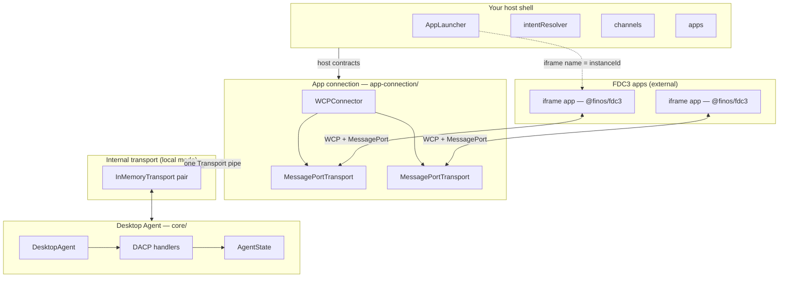
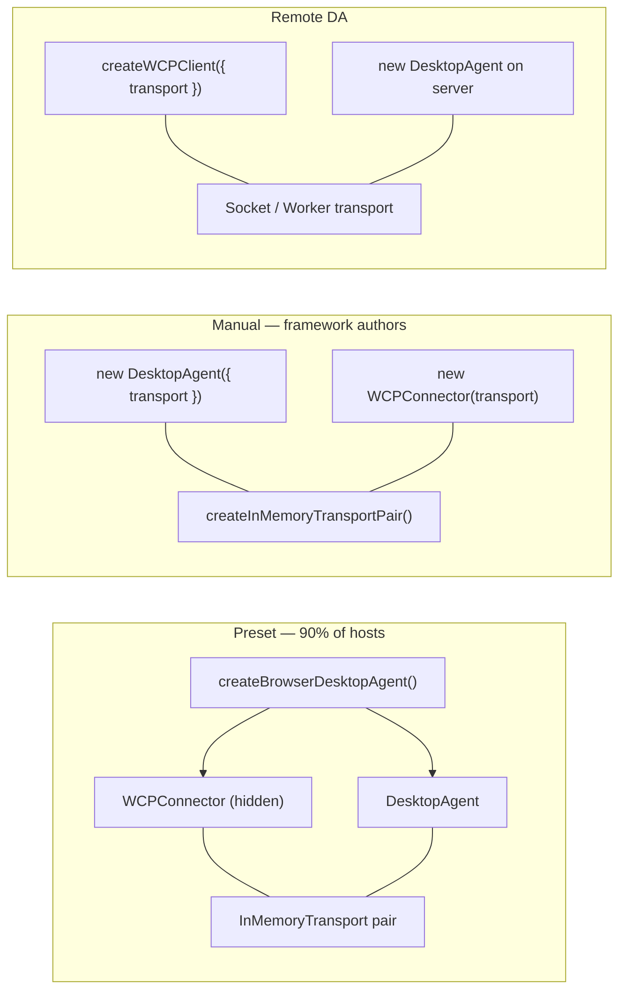
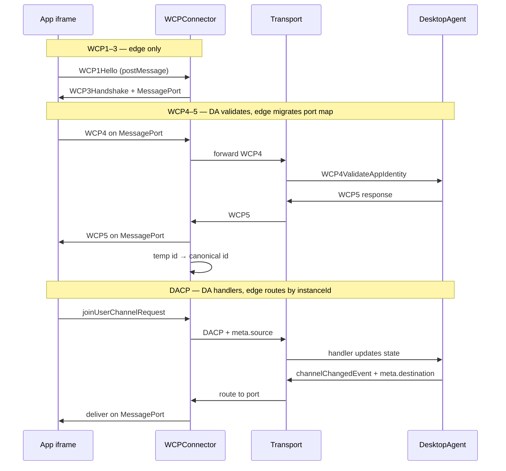
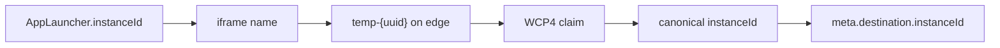
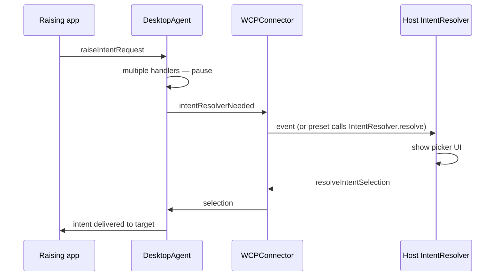
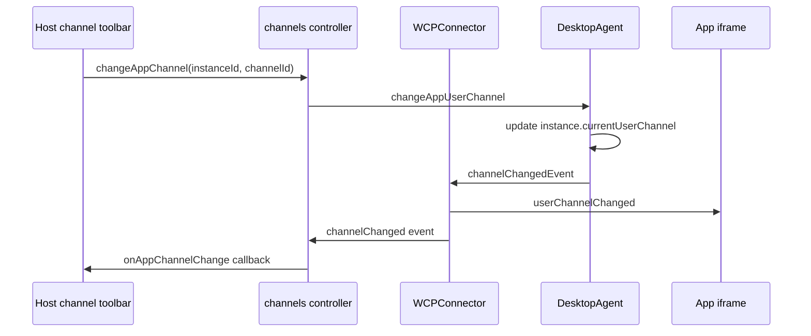

# Composition & internals

How `@finos/sail-desktop-agent` modules compose and interact. For integration steps and copy-paste examples, see the [integrator guide](./integrator-guide).

## Layered runtime model



**Key rule:** apps never talk to `DesktopAgent` directly. All app traffic flows **edge → Transport → DA → Transport → edge → MessagePort**.

## Preset vs manual composition



| Pattern | Returns | You manage |
|---------|---------|------------|
| `createBrowserDesktopAgent` | `DesktopAgent` + `intentResolver`, `channels`, `apps` | `AppLauncher`; wire host UI via controllers |
| `createBrowserHostControllers` | `{ intentResolver, channels, apps }` | Manual `DesktopAgent` + `WCPConnector` composition |
| `getBrowserDesktopAgentSession(da)` | `{ wcpConnector, connectorTransport }` | Advanced edge tests |
| `createWCPClient` | `{ wcpConnector, start, stop }` | Browser side of remote DA |
| Manual pair | `DesktopAgent` + `WCPConnector` | Both transports and lifecycle |

## Source tree responsibilities

```text
packages/sail-desktop-agent/src/
│
├── core/
│   ├── desktop-agent.ts       # DesktopAgent class — start/stop, handler dispatch
│   ├── dacp/                  # DACP message types and helpers
│   ├── handlers/dacp/         # All FDC3 operations (open, channels, intents, …)
│   ├── handlers/dacp/wcp-handlers.ts  # WCP4–5 identity validation
│   ├── state/                 # Immutable AgentState (selectors + mutators)
│   └── app-directory/         # DirectoryApp metadata
│
├── host-contracts/
│   ├── app-launcher.ts        # AppLauncher — host opens iframes/windows
│   ├── intent-resolver.ts     # IntentResolver — disambiguation UI contract
│   └── channel-control.ts     # ChannelControl — picker contract shape
│
├── app-connection/
│   ├── wcp/                   # WCP handshake, routing, connection map
│   ├── wcp-connector.ts       # WCP1–3, postMessage listener, port map
│   └── message-port-transport.ts
│
├── presets/
│   ├── create-browser-desktop-agent.ts  # createBrowserDesktopAgent (local DA + edge)
│   ├── create-wcp-client.ts             # createWCPClient (remote DA mode)
│   └── browser-session.ts               # createBrowserHostControllers, getBrowserDesktopAgentSession
│
└── transports/
    └── in-memory-transport.ts # Same-process linked endpoints
```

## WCP and DACP ownership



| Phase | Owner | Code location |
|-------|--------|---------------|
| WCP1–3 | Edge | `app-connection/wcp-connector.ts`, `app-connection/wcp/wcp1-3-handshake.ts` |
| MessagePort bridge | Edge | `app-connection/message-port-transport.ts`, `app-connection/wcp/wcp-message-routing.ts` |
| WCP4–5 | DA (+ edge port migration) | `core/handlers/dacp/wcp-handlers.ts` |
| WCP6 Goodbye | Both | Edge drops port; DA removes instance |
| DACP (all `fdc3.*`) | DA | `core/handlers/dacp/*` |

## Instance identity pipeline

Toolbox `AppTimeout` usually means a break in this chain:



| Step | Module |
|------|--------|
| Launcher returns id | `host-contracts/app-launcher.ts` |
| Open registers PENDING | `core/handlers/dacp/app-handlers.ts` |
| WCP4 adopt vs mint | `core/handlers/dacp/wcp-handlers.ts` |
| Port map migration | `app-connection/wcp/wcp-connection-management.ts` |

## Intent resolution flow



Two mechanisms exist for intent UI — see [integrator guide — intent resolver](./integrator-guide#intent-resolver--host-shell-ui):

- **Host shell (default):** `intentResolver` controller (canonical; `intentResolverUI` transitional alias) or low-level `IntentResolver` contract
- **WCP3 injection:** `wcpOptions.intentResolverUrl` — `@finos/fdc3` loads iframe in app window

## Channel change flow (host chrome)



Browser preset hosts use **`channels.changeAppChannel`** and **`channels.onAppChannelChange`**. `SailPlatform` wraps the same engine path for the reference stack — see [integrator guide](./integrator-guide#channel-selector--host-shell-ui).

Manual composition without the preset factory: build controllers with **`createBrowserHostControllers({ desktopAgent, wcpConnector, connectorTransport })`** from `@finos/sail-desktop-agent/presets`.

## Testing layers

| Layer | Suite | Proves |
|-------|-------|--------|
| DACP handlers | Cucumber + MockTransport (~103 `@conformance2.2`) | FDC3 handler behaviour |
| Handler units | Vitest in `dacp/__tests__/` | Individual request paths |
| Edge seam | `wcp-desktop-agent.integration.test.ts` | WCP + MessagePort + DA routing |
| Full oracle | FINOS toolbox via conformance harness | End-to-end browser behaviour |

See [conformance traceability](./conformance) for BDD vs toolbox gaps.

## Related

- [Integrator guide](./integrator-guide) — host contracts, presets, deployment decision tree
- [Channel selection (Sail stack)](../../architecture/channel-selection) — `SailPlatform` channel APIs
- [@finos/sail-platform-api](../platform-api/overview) — workspace, layout, `SailPlatform` wrapper
