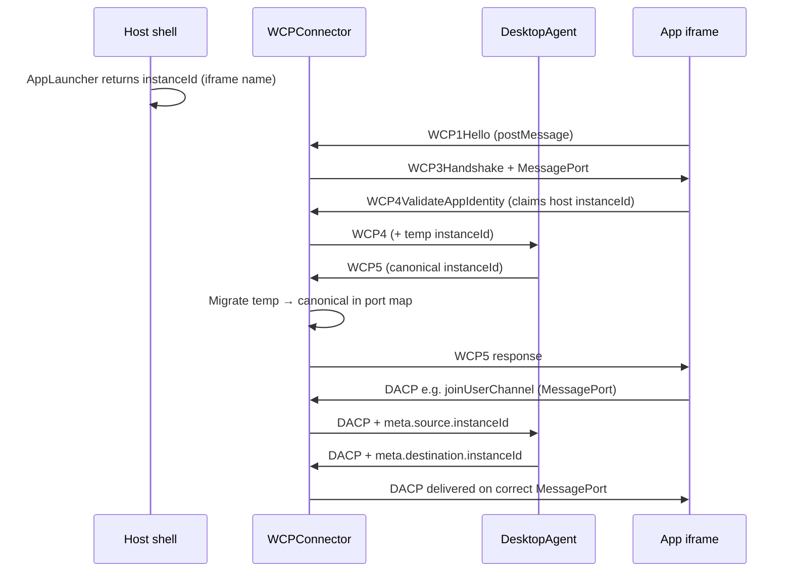
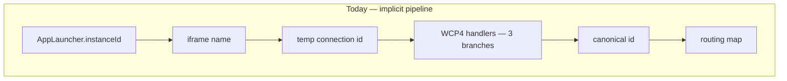
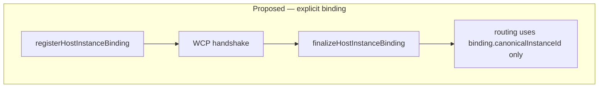

# Browser edge and Desktop Agent

This document is the **primary integrator guide** for FDC3 in the browser. The package implements two cooperating roles:

1. **Browser edge** — everything that talks to child app browsing contexts (WCP, MessagePort, per-app routing).
2. **Desktop Agent (DA)** — headless FDC3 logic (DACP handlers, channel state, intents, instance registry).

Everything else is detail under one of those two boxes.

## Two-box model

```text
┌────────────────────────── BROWSER EDGE ──────────────────────────┐
│  Host shell: iframes, AppLauncher, optional IntentResolver UI    │
│  WCPConnector (app-connection/)                                  │
│    • WCP1–3 handshake (postMessage + MessageChannel)             │
│    • MessagePort per connected app                               │
│    • Routes DACP by meta.destination.instanceId                  │
└────────────────────────────┬─────────────────────────────────────┘
                             │ Transport — ONE pipe (not per app)
                             ▼
┌────────────────────────── DESKTOP AGENT ─────────────────────────┐
│  DesktopAgent (core/)                                            │
│    • All fdc3.* behaviour via DACP handlers                      │
│    • WCP4–5 identity validation → canonical instanceId           │
│    • Channel membership, intents, open-with-context, heartbeat   │
└──────────────────────────────────────────────────────────────────┘
```

| Role | Package path | Speaks to |
|------|--------------|-----------|
| Browser edge | `src/app-connection/` (incl. `wcp/`) | iframe or child-window apps (WCP + MessagePort) |
| Desktop Agent | `src/core/` (incl. `dacp/`) | Host via `Transport`; apps only via edge |

**InMemoryTransport** (local mode) is only the **short internal wire** between edge and DA in the same JS process. It is **not** how apps connect. Toolbox `AppTimeout` failures usually mean **MessagePort routing or instanceId mismatch** on the edge, not broken InMemoryTransport.

## One Desktop Agent per context

FDC3 assumes **one logical Desktop Agent per user session** — one channel graph, one app instance registry, one intent resolution flow. `@finos/sail-desktop-agent` does not enforce that globally: tests and advanced setups may construct multiple `DesktopAgent` instances. **Host integrators must enforce a singleton** in their deployment context.

| Context | Singleton scope | Typical pattern |
|---------|-----------------|-----------------|
| Browser host page | One agent per top-level `window` (tab) | Module-level holder or `window` property |
| Node / worker server | One agent per process (or worker) | Module-level `let` initialized once |
| Remote split | One `DesktopAgent` on the server; one `createWCPClient` edge per browser tab | Server module singleton + per-tab client |

Creating two agents in the same browser tab (for example two `createBrowserDesktopAgent()` calls without sharing state) yields **split-brain**: duplicate WCP listeners, conflicting instance registries, and channel UI that reads the wrong agent.

### Browser tab singleton

Hold the preset handle once for the lifetime of the host page. HMR and strict-mode double mount in dev may call your factory twice — guard with a module-level or `window` holder:

```typescript
import { createBrowserDesktopAgent } from "@finos/sail-desktop-agent/presets"
import type { AppLauncher } from "@finos/sail-desktop-agent"

declare global {
  interface Window {
    __sailDesktopAgent?: ReturnType<typeof createBrowserDesktopAgent>
  }
}

function createAgent(appLauncher: AppLauncher) {
  return createBrowserDesktopAgent({ appLauncher })
}

export function getBrowserDesktopAgent(appLauncher: AppLauncher) {
  if (!window.__sailDesktopAgent) {
    window.__sailDesktopAgent = createAgent(appLauncher)
  }
  return window.__sailDesktopAgent
}

// Host bootstrap (once)
const desktopAgent = getBrowserDesktopAgent(myAppLauncher)
const { intentResolver, channels, apps } = desktopAgent

// Teardown when the host shell unmounts (SPA route change, logout, etc.)
export function destroyBrowserDesktopAgent() {
  window.__sailDesktopAgent?.stop()
  window.__sailDesktopAgent = undefined
}
```

`SailPlatform` and `createBrowserDesktopAgent` follow the same rule: construct **one** platform or preset handle per host page and reuse it for intent, channel, and app controllers.

### Node / server singleton

When the Desktop Agent runs in Node (or a dedicated worker), use a module singleton. The browser tab still runs **`createWCPClient`** — one client edge per tab, one server agent per process:

```typescript
// server/desktop-agent.ts
import { DesktopAgent } from "@finos/sail-desktop-agent"
import { createServerTransport } from "./transport" // WebSocket, IPC, etc.

let agent: DesktopAgent | undefined

export function getServerDesktopAgent(): DesktopAgent {
  if (!agent) {
    agent = new DesktopAgent({ transport: createServerTransport() })
    agent.start()
  }
  return agent
}

export async function stopServerDesktopAgent(): Promise<void> {
  await agent?.stop()
  agent = undefined
}
```

```typescript
// browser/host.ts — one WCP client per tab; transport pairs with the server singleton above
import { createWCPClient } from "@finos/sail-desktop-agent/presets"
import { createBrowserClientTransport } from "./transport"

let wcpClient: ReturnType<typeof createWCPClient> | undefined

export function getWcpClient() {
  if (!wcpClient) {
    wcpClient = createWCPClient({ transport: createBrowserClientTransport() })
    wcpClient.start()
  }
  return wcpClient
}
```

See [How to wire (decision tree)](#how-to-wire-decision-tree) for local vs remote entry points.

### Host channel UI and `getState()`

Channel chrome must use **push events plus granular getters**, not full state snapshots. Prefer `channels.onAppChannelChange` / `channels.getAppChannelId` on the browser preset, or `SailPlatform.changeAppChannel` / `getAppUserChannel` on the reference stack. Do **not** poll or mutate `desktopAgent.getState()` for UI — that API is for tests and debugging only.

Details and platform vs preset APIs: [Channel selector — host shell UI](#channel-selector--host-shell-ui) and [Channel selection architecture](../../architecture/channel-selection.md).

## Host contract example

FDC3 in the browser is three runtime parts. Only the bottom two come from this package; **your host shell** wires the contracts in the middle.

```text
  FDC3 Apps          Your host (contracts + controllers)   FDC3 engine
  @finos/fdc3    →   launcher · intentResolver · channels  →   createBrowserDesktopAgent()
  getAgent()         apps · channel UI · lifecycle              (edge + DA, in-process)
                     open/close · catalog
```

Iframe apps call `fdc3.getAgent()` via `@finos/fdc3` — you do not implement that layer. You **do** implement the host contracts below, then pass them to `createBrowserDesktopAgent`. Host shell UI (intent picker, channel toolbar, app catalog, tab lifecycle) uses the **grouped host controllers** on the preset handle — Sail preset APIs, not FDC3 wire messages.

### Browser mode (engine in same tab)

```typescript
import { createBrowserDesktopAgent } from "@finos/sail-desktop-agent/presets"
import type { AppLauncher } from "@finos/sail-desktop-agent"

const appShell = document.getElementById("app-shell")!

// --- Host contract: open / close browsing contexts (required) ---

const appLauncher: AppLauncher = {
  async launch(request, app) {
    const instanceId = request.app?.instanceId ?? crypto.randomUUID()
    const iframe = document.createElement("iframe")
    iframe.name = instanceId // MUST match WCP4 identity — host ↔ engine link
    iframe.src = app.type === "web" ? (app.details?.url as string) : ""
    iframe.dataset.appId = app.appId
    appShell.appendChild(iframe)
    return { appId: app.appId, instanceId }
  },
  // FDC3 v3.0: invoked when an app calls fdc3.close() — app-initiated self-close
  async close(instanceId) {
    appShell.querySelector(`iframe[name="${instanceId}"]`)?.remove()
  },
}

const desktopAgent = createBrowserDesktopAgent({
  appLauncher,
  // wcpOptions omitted → intentResolverUrl/channelSelectorUrl false (host-owned UI)
})

// Grouped host controllers — primary setup pattern for browser preset hosts
const { intentResolver, channels, apps } = desktopAgent

// Runtime app catalog (primary — not only constructor appDirectories)
await apps.addDirectory("/apps.json")
// apps.add(singleApp) or apps.addAll([...]) for inline entries

// Intent resolver — canonical; intentResolverUI is a transitional alias (same methods)
intentResolver.onRequest(request => {
  void showIntentPicker(request.choices ?? []).then(choice => {
    if (choice) intentResolver.select(request.requestId, choice)
    else intentResolver.cancel(request.requestId)
  })
})

// Channel chrome (default: host toolbar, not WCP3 iframe injection)
const userChannels = channels.getUserChannels()
const currentId = channels.getAppChannelId(activeInstanceId)
await channels.changeAppChannel(activeInstanceId, "fdc3.channel.1")
channels.onAppChannelChange(({ instanceId, channelId }) => {
  updateTabChrome(instanceId, channelId)
})

// Instance lifecycle — replaces direct wcpConnector.on(...) in application code
apps.onConnect(meta => tabs.markConnected(meta.instanceId, meta.appId))
apps.onDisconnect(instanceId => {
  tabs.remove(instanceId)
  appShell.querySelector(`iframe[name="${instanceId}"]`)?.remove()
})
apps.onHandshakeFailure(({ error, connectionAttemptUuid }) => {
  console.error("WCP handshake failed", connectionAttemptUuid, error)
})

// Host tab close — host teardown, not fdc3.close() from the host page
function closeAppTab(instanceId: string) {
  appShell.querySelector(`iframe[name="${instanceId}"]`)?.remove()
  apps.disconnect(instanceId)
}

// Host-initiated open from your launcher UI
await apps.open("portfolio-app", { context: instrumentContext })

// desktopAgent.stop() when tearing down the host
```

| Host concern | Required? | Primary API |
|--------------|-----------|-------------|
| `appLauncher` | **Yes** — FDC3 `open()` creates iframes/windows | `createBrowserDesktopAgent({ appLauncher })` |
| App catalog | **Yes** — metadata for open/intent resolution | `apps.addDirectory`, `apps.add` / `apps.addAll` (or constructor `appDirectories` / `apps`) |
| Intent resolver UI | When multiple handlers match | `intentResolver.*` (`intentResolverUI` alias — prefer `intentResolver`) |
| Channel chrome | Recommended when `channelSelectorUrl` is false (default) | `channels.getUserChannels`, `channels.changeAppChannel`, `channels.onAppChannelChange` |
| Instance lifecycle | Recommended — tabs, cleanup | `apps.onConnect` / `onDisconnect` / `onHandshakeFailure`; host tab close via `apps.disconnect` |
| App self-close | When supporting FDC3 v3.0 `fdc3.close()` | `AppLauncher.close` on the launcher you pass to the preset |

`createBrowserDesktopAgent` returns a single `DesktopAgent` handle with grouped controllers attached; the browser edge starts and stops with `desktopAgent.start()` / `desktopAgent.stop()`. You do not manage `WCPConnector` in application code.

### FDC3 boundary

| Who | API |
|-----|-----|
| **Apps** (iframe / child window) | `@finos/fdc3` — `getAgent()`, `joinUserChannel`, `broadcast`, `raiseIntent`, `fdc3.close()`, … |
| **Host shell** (your page) | Sail preset controllers — `intentResolver`, `channels`, `apps` on the `createBrowserDesktopAgent` handle |

Apps must not import `@finos/sail-desktop-agent`. Host code must not call `fdc3.close()` on behalf of an app — use `apps.disconnect` for host-initiated teardown and implement `AppLauncher.close` for app-initiated `fdc3.close()`.

### Host controllers reference

Grouped controllers are attached to every `createBrowserDesktopAgent` handle. Destructure once and pass slices to your UI layer.

| Controller | Key methods | Notes |
|------------|-------------|-------|
| **`intentResolver`** | `onRequest`, `select`, `cancel`, `getPendingRequests` | Canonical; `intentResolverUI` is the same surface |
| **`channels`** | `getUserChannels`, `getAppChannelId`, `getAppChannel`, `changeAppChannel`, `onAppChannelChange` | Host channel chrome — not raw `connectorTransport` |
| **`apps`** | `addDirectory`, `add`, `addAll`, `remove`, `getAll`, `getById`, `open`, `getInstances`, `getInstance`, `getConnections`, `getConnection`, `disconnect`, `onConnect`, `onDisconnect`, `onHandshakeFailure` | Runtime catalog + instance lifecycle; no `apps.close` |

Constructor `appDirectories` / `apps` still work for static seeding; **`apps.addDirectory` and `apps.add` are the primary runtime pattern** when the catalog loads after host init or changes over time.

### Unsubscribe pattern (framework-neutral)

Controller subscription methods return an unsubscribe function. Call it when your UI unmounts or the listener is no longer needed.

**React:**

```typescript
useEffect(() => {
  const offConnect = apps.onConnect(meta => setTabs(t => [...t, meta]))
  const offChannel = channels.onAppChannelChange(e => setChannel(e.channelId))
  const offIntent = intentResolver.onRequest(req => setPending(req))
  return () => {
    offConnect()
    offChannel()
    offIntent()
  }
}, [apps, channels, intentResolver])
```

**Vanilla:**

```typescript
const offDisconnect = apps.onDisconnect(id => removeTab(id))
// later, when tearing down the host shell:
offDisconnect()
```

**Svelte / Vue:** store the returned function and call it in `onDestroy` / `onUnmounted` (or when replacing the listener).

## `getAgent()` discovery support

FDC3 `getAgent()` supports more than one web mechanism. Sail's browser host implements the browser-resident **proxy** mechanism: a child app sends `WCP1Hello` with `postMessage`, Sail replies with `WCP3Handshake`, and app API calls then travel over a `MessagePort` using DACP.

| Scenario | Does standard `getAgent()` find Sail? | What to do |
|----------|---------------------------------------|------------|
| App in an iframe owned by the Sail host | Yes. This is the primary and tested browser path. | Set the iframe `name` to the host instance id and list the app URL in the app directory. |
| App opened with `window.open` by the Sail host | Can work if the child keeps `window.opener` and the app directory identity matches. | Implement a window-based `AppLauncher`; this is not the default `sail-web` launcher. |
| App in a traditional preload-style container | `getAgent()` can return `window.fdc3` when the container injects it. | This is a different FDC3 web interface. Sail's browser preset does not currently install `window.fdc3` into the host page. |
| React component rendered in the same top-level page as the Sail host | No, not as a separate standard FDC3 app. There is no parent/opener for proxy discovery, and no Sail preload object is installed. | Treat it as host UI and use `SailPlatform` / `DesktopAgent` host APIs, or put it in an iframe/window. |

This is the key difference for teams coming from preload-style desktop agents: in the browser-resident model, independent apps usually need independent browsing contexts. Same-page components can still participate in the product UI, but they are not separate FDC3 app instances through `@finos/fdc3` unless Sail later provides a dedicated top-level adapter.

The browsing-context boundary is also a feature. A Sail host can embed apps from different teams and technology stacks side by side: React, Vue, Angular, Svelte, or plain JavaScript. Each app owns its bundle and deployment URL; Sail owns launch, identity, channels, intents, and lifecycle.

### App code

Application code should stay vendor-neutral and use the FDC3 package:

```typescript
import { fdc3 } from "@finos/fdc3"

const agent = await fdc3.getAgent()

await agent.addContextListener("fdc3.instrument", context => {
  console.log("instrument context", context)
})

await agent.broadcast({
  type: "fdc3.instrument",
  id: { ticker: "AAPL" },
})
```

Host code supplies the app directory and launches the app. App code should not import `@finos/sail-desktop-agent`, inspect parent windows, or manually speak DACP.

### Same-page components

If your "app" is a React component rendered inside the same page that created `SailPlatform` or `createBrowserDesktopAgent`, it is part of the host shell. Use the host APIs already available in that process:

```typescript
const platform = new SailPlatform({ appLauncher, intentResolver })
platform.start()

const channels = platform.getUserChannels()
const currentChannel = platform.getAppUserChannel(instanceId)
await platform.changeAppChannel(instanceId, "fdc3.channel.1")
```

If you need those components to behave like independent FDC3 apps with their own identity, listeners, channel membership, and lifecycle, launch each one in an iframe or child window. A future Sail component adapter could provide a direct in-page API, but that would be a Sail-specific integration path rather than the standard `@finos/fdc3` `getAgent()` discovery path.

Installing a global `window.fdc3` object in the host page would not by itself make each component an independent app. Every component would see the same global API and share the same browsing context. Without an additional Sail-owned identity layer, their listeners, channel membership, and app metadata would all belong to one host-page app identity. Multiple component libraries should therefore not each try to install their own `window.fdc3`; that would create competing globals rather than separate FDC3 apps.

### Wiring intent resolver and channel selector UI

FDC3 defines **two different mechanisms** for each UI. Sail and this package default to **host-owned UI** (no iframe injected into the app window).

| UI | Mechanism A — host shell (recommended) | Mechanism B — WCP3 iframe injection |
|----|----------------------------------------|-------------------------------------|
| Intent resolver | `desktopAgent.intentResolver` (canonical; `intentResolverUI` transitional alias) or low-level `IntentResolver` contract | `wcpOptions.intentResolverUrl` — `@finos/fdc3` loads a page **inside the app window** |
| Channel selector | Host toolbar + `channels.changeAppChannel` | `wcpOptions.channelSelectorUrl` — `@finos/fdc3` loads a page **inside the app window** |

**Default (omit `wcpOptions`):** both URLs are `false` — your host shell owns both UIs. This matches FDC3 when the [browser-resident host](https://fdc3.finos.org/docs/api/specs/browserResidentDesktopAgents) renders chrome outside the app iframe.

#### Intent resolver — host shell UI

When `raiseIntent` or `raiseIntentForContext` is ambiguous, the engine pauses and asks the host to pick one choice. Explicit `AppIdentifier` targets and unambiguous matches bypass this UI.

**Option 1 — grouped controller (recommended):** use `intentResolver` on the browser preset handle:

```typescript
const desktopAgent = createBrowserDesktopAgent({ appLauncher })
const { intentResolver } = desktopAgent

const offRequest = intentResolver.onRequest(request => {
  // Open YOUR modal — React dialog, Vue component, native picker, etc.
  void myIntentModal.open({
    context: request.context,
    choices: request.choices ?? [],
  }).then(choice => {
    if (choice) intentResolver.select(request.requestId, choice)
    else intentResolver.cancel(request.requestId)
  })
})

// intentResolver.getPendingRequests() for multi-request UI state
// Call offRequest() on teardown (see Unsubscribe pattern above)
```

`intentResolverUI` exposes the same methods and remains on the handle for backward compatibility — prefer **`intentResolver`**.

The resolver request includes running app instances, launchable app rows, and display metadata from the app directory where available (`title`, `name`, `icons`, `screenshots`, `instanceMetadata`). A selected choice feeds the normal Desktop Agent delivery path: launch if needed, wait for the listener if needed, send the `intentEvent`, and return `IntentResolution` to the raising app.

The `intentResolver` request/response shapes are Sail host UI adapter types, not official FDC3 DACP or WCP wire messages.

**Option 2 — low-level host contract:** provide your own `IntentResolver` if you want to own promise correlation yourself:

```typescript
const desktopAgent = createBrowserDesktopAgent({
  appLauncher,
  intentResolver: {
    async resolve(request) {
      const choice = await myIntentModal.open({ choices: request.choices ?? [] })
      if (!choice) return null
      return {
        selectedHandler: choice.handler,
        target: {
          appId: choice.handler.app.appId,
          instanceId: choice.handler.instanceId,
        },
        intent: choice.intent.name,
      }
    },
  },
})
```

**Option 3 — connector event listener (advanced):** use only when you already hold `wcpConnector` (`createWCPClient`) or need `getBrowserDesktopAgentSession`:

```typescript
import { getBrowserDesktopAgentSession } from "@finos/sail-desktop-agent/presets"

const { wcpConnector } = getBrowserDesktopAgentSession(desktopAgent)

wcpConnector.on("intentResolverNeeded", payload => {
  void myIntentModal.open(payload).then(selection => {
    wcpConnector.resolveIntentSelection({
      requestId: payload.requestId,
      selectedHandler: selection
        ? { appId: selection.appId, instanceId: selection.instanceId }
        : null,
    })
  })
})
```

`intentResolverNeeded` is a Sail browser connector event, not an official FDC3 WCP wire message. Prefer **`intentResolver`** unless you are doing manual connector composition.

**Option 4 — injected iframe (uncommon for custom hosts):**

```typescript
createBrowserDesktopAgent({
  appLauncher,
  wcpOptions: { intentResolverUrl: true }, // FINOS reference UI, or a URL string
})
```

No `intentResolver` contract needed — `@finos/fdc3` hosts the picker inside each app window.

#### Channel selector — host shell UI

When `channelSelectorUrl` is `false` (default), the **host** renders channel chrome (toolbar button, per-app dropdown). The app does not get an injected channel iframe.

Use the **`channels`** controller on the browser preset handle:

1. **List** channels: `channels.getUserChannels()`
2. **Read** current channel: `channels.getAppChannelId(instanceId)` or `channels.getAppChannel(instanceId)` (includes channel object)
3. **Change** channel: `await channels.changeAppChannel(instanceId, channelId | null)`
4. **Listen** for updates: `channels.onAppChannelChange(listener)` — push model; do not poll `getState()`

Do **not** read or mutate `desktopAgent.getState()` for channel chrome. `getState()` is for tests and debugging only.

With **`createBrowserDesktopAgent`** (preset — no platform-api):

```typescript
const { channels } = desktopAgent

const userChannels = channels.getUserChannels()
const currentId = channels.getAppChannelId(instanceId)

channels.onAppChannelChange(({ instanceId, channelId, channel }) => {
  updateTabChrome(instanceId, channelId, channel)
})

// Host toolbar click handler
channelButton.onclick = () => {
  void channels.changeAppChannel(activeInstanceId, "fdc3.channel.1")
}
```

With **`SailPlatform`** (reference stack — wraps the same engine path):

```typescript
const platform = new SailPlatform({ appLauncher, intentResolver })
await platform.start()

// In your ChannelSelector component (see packages/sail-web/src/components/ChannelSelector.tsx):
const channels = platform.getUserChannels()
const currentId = platform.getAppUserChannel(instanceId)
await platform.changeAppChannel(instanceId, channelId) // or null to leave

// Keep toolbar state in sync (push model — do not poll getState())
platform.connector.on("channelChanged", (id, channelId) => {
  updateTabChrome(id, channelId)
})
```

`ChannelControl` in `host-contracts/` describes the **picker contract** (`selectChannel(request)`); wire your toolbar to call `channels.changeAppChannel` (or `platform.changeAppChannel`) with the chosen channel id. Sail web uses `SailPlatform.changeAppChannel` plus connector push events (`connection-store.ts` subscribes; `ChannelSelector.tsx` reads from the store, not `getState()`).

**Injected channel iframe (uncommon):**

```typescript
createBrowserDesktopAgent({
  appLauncher,
  wcpOptions: { channelSelectorUrl: "/host/channel-selector.html" }, // or true for FINOS reference
})
```

#### End-to-end with Sail (reference stack)

```text
SailPlatform.start()
  → createBrowserDesktopAgent({ wcpOptions: false/false })
  → SailDesktopAgentProvider wires stores to platform.connector events
  → <IntentResolverDialog /> listens via intent-resolver-store
  → <ChannelSelector instanceId={...} /> calls platform.changeAppChannel
```

See `packages/sail-web/src/contexts/SailDesktopAgentContext.tsx` for provider wiring.

### Remote engine (server or Web Worker)

Host contracts stay the same on the **browser** side; only engine placement changes.

```typescript
import { createWCPClient } from "@finos/sail-desktop-agent/presets"
import { DesktopAgent } from "@finos/sail-desktop-agent"
import type { AppLauncher } from "@finos/sail-desktop-agent"

// Browser host — same appLauncher, same iframe shell, same lifecycle UI
const { wcpConnector, start, stop } = createWCPClient({
  transport: mySocketOrWorkerTransport,
  // same wcpOptions default: host-owned intent/channel UI
})

wcpConnector.on("appConnected", meta => tabs.markConnected(meta.instanceId, meta.appId))
wcpConnector.on("appDisconnected", id => tabs.remove(id))
start()

// Remote process — engine only (no WCP, no iframes)
const agent = new DesktopAgent({
  transport: serverTransport,
  appLauncher: serverSideLauncherOrStub, // if open() originates server-side
  appDirectories: ["/apps.json"],
})
agent.start()
```

For the full Sail stack (workspace, layout, pre-built launcher/resolver/channel UI), use `SailPlatform` in `@finos/sail-platform-api` — it implements the same host contracts and delegates engine wiring to this package.

## FDC3 2.2 alignment

This package implements a [Browser-Resident Desktop Agent](https://fdc3.finos.org/docs/api/specs/browserResidentDesktopAgents) with the split prescribed by FDC3 2.2:

| FDC3 2.2 concept | This package |
|------------------|--------------|
| `getAgent()` / WCP connection | **Edge** (`WCPConnector`) — WCP1–3, per-app `MessagePort` |
| DACP over `MessagePort` | **DA** (`DesktopAgent`) — all `fdc3.*` API behaviour |
| WCP4 `ValidateAppIdentity` | **DA** — `core/handlers/dacp/wcp-handlers.ts` |
| WCP5 success / failure | **DA** responds; **edge** migrates port map to canonical `instanceId` |
| WCP6 `Goodbye` | **Edge** tears down port; **DA** cleans registry |

Spec references (v2.2):

- [Web Connection Protocol](https://fdc3.finos.org/docs/api/specs/webConnectionProtocol) — handshake, UI URL fields, identity validation
- [Browser-Resident Desktop Agents](https://fdc3.finos.org/docs/api/specs/browserResidentDesktopAgents) — host shell responsibilities
- [Desktop Agent Communication Protocol](https://fdc3.finos.org/docs/api/specs/desktopAgentCommunicationProtocol) — DACP request/response routing via `meta.source` / `meta.destination`

### WCP phases (spec vs implementation)

| Step | FDC3 2.2 requirement | Owner in this package |
|------|------------------------|------------|
| WCP1 `Hello` | App posts to parent; includes `connectionAttemptUuid` | App (`@finos/fdc3`); edge listens |
| WCP3 `Handshake` | DA returns `MessagePort` + `intentResolverUrl` + `channelSelectorUrl` | Edge sends; values from `wcpOptions` |
| WCP4 | First message on port; `identityUrl` / `actualUrl` origins MUST match `WCP1` origin | DA validates |
| WCP4 reconnect | Optional `instanceId` + `instanceUuid`; DA MUST verify `instanceUuid` secret and `WindowProxy` | DA (`instance-identity-registry`) |
| WCP5 | DA assigns or reuses `appId`, `instanceId`, `instanceUuid` | DA; edge updates routing |
| DACP | All FDC3 API traffic on validated port | DA handlers; edge routes by `meta.destination.instanceId` |

### Injected UI URLs (`WCP3Handshake` payload)

FDC3 names these fields **`intentResolverUrl`** and **`channelSelectorUrl`** on the WCP3 payload. Each MAY be:

- a **URL string** — `@finos/fdc3` loads that page in an iframe for the app window;
- **`false`** — the app does not need an injected iframe (host or DA provides UI another way);
- **`true`** — use the FINOS reference UI.

This package defaults both to **`false`** when `wcpOptions` is omitted. That is spec-compliant when the host renders channel chrome and intent resolution outside injected iframes (see [Channel Selector and Intent Resolver](https://fdc3.finos.org/docs/api/specs/browserResidentDesktopAgents#channel-selector-and-intent-resolver-user-interfaces)).

**Two different “intent resolver” mechanisms:**

| Mechanism | Purpose |
|-----------|---------|
| WCP3 `intentResolverUrl` | iframe URL injected **into the app window** by `@finos/fdc3` |
| `intentResolver` on the browser preset handle | Host UI methods when DA needs disambiguation; not an official DACP/WCP message |
| `intentResolverUI` on the browser preset handle | Transitional alias — same methods as `intentResolver` |
| `intentResolver` option on `createBrowserDesktopAgent` | Low-level host callback for custom composition |

Most browser hosts use **`false`** for WCP3 URLs and implement resolver/channel UI in the host shell via [host contracts](https://github.com/finos/FDC3-Sail/tree/main/packages/sail-desktop-agent/src/host-contracts).

### Package extensions (not FDC3 API)

These behaviours stay within FDC3 MUSTs but are host conventions supported by this library:

- **`iframe name = launcher instanceId`** — correlates `AppLauncher` output with WCP4; cross-origin iframes may not expose `window.name` to the host (integration tests use same-origin fixtures).
- **Host-adopt path** — `open` registers a `PENDING` instance; WCP4 may claim that `instanceId` before first connect so canonical id matches the launcher (supports `open()` returning `instanceId` early).
- **`HostInstanceBinding`** (below) — proposed integrator sugar only; not part of the FDC3 standard.

## Heartbeat and liveness configuration

FDC3 2.2 defines [`heartbeatEvent`](https://fdc3.finos.org/docs/api/specs/desktopAgentCommunicationProtocol#checking-apps-are-alive) / [`heartbeatAcknowledgment`](https://fdc3.finos.org/docs/api/specs/desktopAgentCommunicationProtocol#checking-apps-are-alive) as an optional **Desktop Agent** liveness mechanism — “periodically or on demand,” depending on how the app is connected. Apps respond when the DA sends a heartbeat; there is **no** `getAgent()` parameter to disable it from the app side.

Sail exposes heartbeat as **host-level configuration** on `DesktopAgent` / `createBrowserDesktopAgent` / `SailPlatform`. Settings apply to **every** connected instance for that agent — not per app or per entry in the app directory.

| Option | Default | Purpose |
|--------|---------|---------|
| `heartbeatEnabled` | `true` | When `true`, start DACP heartbeat after successful WCP5. When `false`, skip heartbeat timers and `heartbeatEvent` traffic. |
| `heartbeatIntervalMs` | `30_000` | Milliseconds between heartbeat sends (only when enabled). |
| `heartbeatTimeoutMs` | `60_000` | Milliseconds without an ack before the instance is torn down (only when enabled). |

Product defaults live in `packages/sail-desktop-agent/src/core/sail-default-config.ts` and merge in the `DesktopAgent` constructor via `resolveDesktopAgentConfig()`.

```typescript
import { createBrowserDesktopAgent } from "@finos/sail-desktop-agent/presets"

const desktopAgent = createBrowserDesktopAgent({
  appLauncher,
  heartbeatEnabled: true, // default — omit to keep enabled
  heartbeatIntervalMs: 30_000,
  heartbeatTimeoutMs: 60_000,
})

// Disable heartbeat when the host relies on WCP6 / MessagePort teardown only
const quietAgent = createBrowserDesktopAgent({
  appLauncher,
  heartbeatEnabled: false,
})
```

```typescript
// Remote or manual composition — same options on DesktopAgent
import { DesktopAgent } from "@finos/sail-desktop-agent"

const agent = new DesktopAgent({
  transport: daTransport,
  appLauncher,
  heartbeatEnabled: false,
})
```

**When to disable:** rare — e.g. local debugging, or a host that implements disconnect detection solely via [WCP6 Goodbye](https://fdc3.finos.org/docs/api/specs/webConnectionProtocol#step-5-disconnection) and port teardown. Production and conformance runs should normally leave heartbeat **enabled**; browser-resident agents often combine heartbeat with WCP6 and other signals.

**Logging vs protocol:** `@finos/fdc3` `getAgent({ logLevels: { proxy: "WARN" } })` hides `"Responding to heartbeat request"` in the browser console only. It does not stop heartbeat on the wire — use `heartbeatEnabled: false` on the host agent for that.

**Tests:** Cucumber uses shorter intervals via world config (`heartbeatIntervalMs` / `heartbeatTimeoutMs`). Vitest edge tests assert no connect-time flood when defaults are applied correctly.

## Connection lifecycle (happy path)



**Debugging rule:** follow **one instanceId** from launcher → iframe `name` → WCP4 payload → WCP5 canonical → `meta.destination.instanceId`. A break anywhere in that chain produces toolbox `AppTimeout`.

## Where WCP lives

| Phase | Owner | Location |
|-------|--------|----------|
| WCP1–3 (Hello, Handshake, MessageChannel) | **Edge** | `app-connection/wcp-connector.ts`, `app-connection/wcp/wcp1-3-handshake.ts` |
| Per-app MessagePort bridge | **Edge** | `app-connection/message-port-transport.ts`, `app-connection/wcp/wcp-message-routing.ts` |
| WCP4–5 (validate identity, canonical id) | **DA** | `core/handlers/dacp/wcp-handlers.ts` |
| WCP6 (Goodbye) | **Both** | Edge disconnects port; DA cleans registry |
| DACP (open, channels, intents, …) | **DA** | `core/handlers/dacp/*` |

Integrators normally touch **presets/factories** and **host contracts** (`AppLauncher`, `IntentResolver`), not WCP internals.

## How to wire (decision tree)

Use this tree instead of reading four parallel README patterns.

```text
Where does the Desktop Agent run?
│
├─ Same browser tab as your host UI
│    → createBrowserDesktopAgent() from @finos/sail-desktop-agent/presets
│    → Implement AppLauncher (iframes + instanceId on iframe name)
│    → Wire host UI via intentResolver, channels, apps controllers
│
└─ Remote (Node server, Web Worker, …)
     → Server/worker: new DesktopAgent({ transport: serverTransport })
     → Browser host: createWCPClient({ transport: clientTransport })
     → Same AppLauncher / iframe responsibilities on the browser side
```

| Integrator goal | Entry point | Avoid unless advanced |
|-----------------|-------------|------------------------|
| Ship a browser desktop | `createBrowserDesktopAgent` | Manual `InMemoryTransport` + `WCPConnector` |
| Remote DA | `createWCPClient` + server `DesktopAgent` | Duplicating WCP in app code |
| Unit-test FDC3 handlers | `MockTransport` + `DesktopAgent` | Expecting this to prove iframe delivery |

**Canonical import:** `@finos/sail-desktop-agent/presets` for application code and factories. `@finos/sail-desktop-agent/browser` (app-connection) remains for tree-shaking when you only need `WCPConnector` or `MessagePortTransport`.

## Public API — today vs simplified story

### Today (four equal-looking patterns in README)

```typescript
// Pattern 1 — preset
import { createBrowserDesktopAgent } from "@finos/sail-desktop-agent/presets"

// Pattern 2 — same factory, different path
import { createBrowserDesktopAgent } from "@finos/sail-desktop-agent/presets"

// Pattern 3 — remote client
import { createWCPClient } from "@finos/sail-desktop-agent/presets"

// Pattern 4 — manual
const [daTransport, wcpTransport] = createInMemoryTransportPair()
const desktopAgent = new DesktopAgent({ transport: daTransport })
const wcpConnector = new WCPConnector(wcpTransport)
```

### Browser edge (internal to the preset)

`createBrowserDesktopAgent` couples a hidden **`WCPConnector`** (the browser edge) to the returned `DesktopAgent`:

- `desktopAgent.start()` also starts the edge (`window` listener for WCP1, MessagePort routing)
- `desktopAgent.stop()` tears down the edge and the DA transport

You do **not** destructure or manage `wcpConnector` in application code. Host code uses grouped controllers (`intentResolver`, `channels`, `apps`) plus `appLauncher`. Optional `onAppConnected` / `onAppDisconnected` callbacks remain for backward compatibility — prefer `apps.onConnect` / `apps.onDisconnect`.

Advanced access (manual composition, edge-contract tests): `getBrowserDesktopAgentSession(desktopAgent)` or `createBrowserHostControllers({ desktopAgent, wcpConnector, connectorTransport, intentResolverUI })` from `@finos/sail-desktop-agent/presets`.

### Simplified integrator surface

```typescript
// 90% of browser hosts — one entry
import { createBrowserDesktopAgent } from "@finos/sail-desktop-agent/presets"

const desktopAgent = createBrowserDesktopAgent({ appLauncher: myLauncher })
const { intentResolver, channels, apps } = desktopAgent

await apps.addDirectory("/apps.json")

intentResolver.onRequest(showIntentResolver)
channels.onAppChannelChange(updateChannelChrome)
apps.onConnect(meta => mountTab(meta))

// Auto-started by default — iframe apps connect via fdc3.getAgent()
```

Teardown: `desktopAgent.stop()`. Pass `autoStart: false` only if you must configure the agent before the edge listens, then call `desktopAgent.start()` yourself.

```typescript
// Injected FINOS reference UIs (WCP3 payload) — uncommon when the host owns UI
createBrowserDesktopAgent({
  appLauncher: myLauncher,
  wcpOptions: { intentResolverUrl: true, channelSelectorUrl: true },
})

// Custom iframe URLs (same names as FDC3 WCP3 payload fields)
createBrowserDesktopAgent({
  appLauncher: myLauncher,
  wcpOptions: {
    intentResolverUrl: "/host/intent-resolver.html",
    channelSelectorUrl: "/host/channel-selector.html",
  },
})

// Per-instance URLs — keep getters when URL depends on instanceId
createBrowserDesktopAgent({
  appLauncher: myLauncher,
  wcpOptions: {
    getChannelSelectorUrl: id => `/channels?instance=${id}`,
  },
})
```

```typescript
// Remote DA — browser side only
import { createWCPClient } from "@finos/sail-desktop-agent/presets"

const { wcpConnector, start } = createWCPClient({
  transport: myWebSocketClientTransport,
  // omit wcpOptions — same false/false default as local preset
})
start()
```

Manual composition stays in an **Advanced** appendix for framework authors, not the main quick start.

### `wcpOptions` — do you need to change anything?

**No.** Omitting `wcpOptions` already produces `intentResolverUrl: false` and `channelSelectorUrl: false` on every WCP3Handshake (see `WCPConnector` constructor). You do **not** need:

```typescript
wcpOptions: {
  getIntentResolverUrl: () => false,
  getChannelSelectorUrl: () => false,
}
```

unless you prefer the explicit form. Static fields (`intentResolverUrl`, `channelSelectorUrl`) mirror the FDC3 payload names and are equivalent to constant getters. Use **`getIntentResolverUrl` / `getChannelSelectorUrl`** only when the URL varies per connection (`instanceId` at handshake time is still `temp-{uuid}` until WCP5).

## Instance identity — today vs proposed

### Today (logic spread across modules)

Identity is correct when several conditions align, but the story is implicit:

```text
AppLauncher.launch() → instanceId
       ↓
iframe name={instanceId}
       ↓
WCP1Hello → temp-{connectionAttemptUuid} on edge connection map
       ↓
WCP4 payload.instanceId + instanceUuid + sourceWindow
       ↓
wcp-handlers: canReuse | canAdoptPendingHost | else createAppInstance (new UUID)
       ↓
WCP5 canonical instanceId → edge migrates MessagePort map temp → canonical
       ↓
open-with-context / broadcast / raiseIntent use meta.destination.instanceId
```

Relevant code today:

- Launcher contract: `src/host-contracts/app-launcher.ts`
- Open registers **PENDING**: `src/core/handlers/dacp/app-handlers.ts`
- WCP4 adopt vs mint: `src/core/handlers/dacp/wcp-handlers.ts` (`canAdoptPendingHostInstance`, `createAppInstance`)
- Port map migration: `src/app-connection/wcp/wcp-connection-management.ts`, `wcp-message-routing.ts`
- Open-with-context waits on target id: `src/core/handlers/dacp/utils/open-with-context.ts`



### Proposed (same split, explicit binding) — not in FDC3 2.2

Keep edge + DA split. Add a **single host-facing contract** and one log line per transition (illustrative future API):

```typescript
// host-contracts/instance-binding.ts (proposed — illustrative)

/** One correlation record per launched iframe; edge + DA share this view. */
export interface HostInstanceBinding {
  /** From AppLauncher / iframe name — host authority */
  launcherInstanceId: string
  /** WCP1Hello correlation */
  connectionAttemptUuid: string
  /** After WCP5 — used in all DACP meta.destination */
  canonicalInstanceId: string
}

/** Host calls when mounting iframe (proposed API) */
export function registerHostInstanceBinding(
  wcpConnector: WCPConnector,
  binding: Pick<HostInstanceBinding, "launcherInstanceId" | "connectionAttemptUuid">
): void {
  // Edge: ensure PENDING instance exists under launcherInstanceId
  // Edge: log [instance-binding] registered launcher=… attempt=…
}

/** Edge calls after WCP5 (proposed) */
export function finalizeHostInstanceBinding(
  binding: HostInstanceBinding
): void {
  // Assert canonical === launcher when adopt path taken
  // log [instance-binding] canonical=… launcher=… match=true|false
}
```



**No merge of edge and DA** — only a named object and structured logs so toolbox debugging is “follow `HostInstanceBinding`,” not grep three folders.

## Testing model

| Suite | Proves | Does not prove |
|-------|--------|----------------|
| Cucumber + `MockTransport` (~103 `@conformance2.2`) | DA / DACP handler behaviour | iframe MessagePort delivery |
| Vitest handler tests | Individual DACP paths | WCP handshake |
| **Edge contract** (`wcp-desktop-agent.integration.test.ts`) | Edge + DA + MessagePort seam | Full FINOS toolbox oracle |

**Edge contract tests** (maintain here):

1. Single app: WCP4 → temp→canonical migration (existing).
2. Two apps: user-channel broadcast received on listener app.
3. Host instanceId: open → PENDING → WCP4 adopt → canonical === launcher id.
4. Assert `meta.destination.instanceId` on delivered `broadcastEvent`.

Run:

```bash
npm test -w @finos/sail-desktop-agent -- wcp-desktop-agent.integration
```

## Related docs

- [Package overview](./overview)
- [Composition & internals](./composition)
- [Conformance traceability](./conformance)