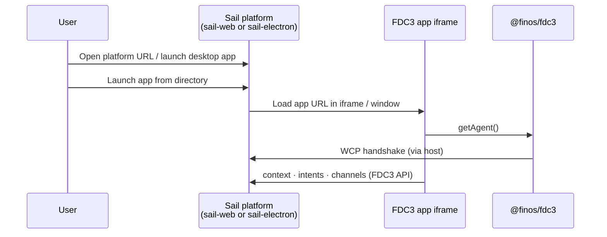

# Run Sail

Use this guide when you want to **run or host the FDC3 Sail platform** with minimal custom code — the full workspace UI, intent resolver, channel selector, and app directory wired for you.

You do **not** need to implement host contracts yourself. Configure your app directory, build or run the product, and connect FDC3 applications.

## Browser or desktop

| Target | Package | Best for |
|--------|---------|----------|
| **Browser / PWA** | `@finos/sail-web` | URL or installable PWA; simplest deployment; no native installer |
| **Desktop app** | `@finos/sail-electron` | Native window, packaging for IT-managed distribution |

Both targets expose a **Desktop Agent** to FDC3 apps the same way. Your applications still use `@finos/fdc3` and `getAgent()` — see [Add your app to Sail](./add-your-app).

For a detailed comparison (sandboxing, updates, OS integration), see [Deployment targets](./architecture/deployment-targets).

## Prerequisites

- Node.js **24+**
- npm **11+**

```bash
nvm use 24
```

## Quick start (from source)

The Sail platform packages (`sail-web`, `sail-electron`) are developed in the [FDC3-Sail monorepo](https://github.com/finos/FDC3-Sail). Clone and run:

```bash
git clone https://github.com/finos/FDC3-Sail.git
cd FDC3-Sail
npm install
```

### Browser mode

```bash
npm run dev
```

This starts the Desktop Agent, platform API, server stub, and Sail web UI. Open **http://localhost:3000**.

### Desktop mode (Electron)

```bash
npm run dev:desktop
```

Starts the server stub and Electron shell (`sail-server` + `@finos/sail-electron`). The Electron window loads `http://localhost:8090` by default (`SAIL_URL`).

For the full Sail web UI inside Electron during development, run the browser stack first, then point Electron at port 3000:

```bash
npm run dev   # terminal 1 — agent, platform-api, server, web on :3000
SAIL_URL=http://localhost:3000 npm run dev -w @finos/sail-electron   # terminal 2
```

`@finos/sail-electron` is optional and not part of the default root `npm run build` until its build is restored.

## App directory

FDC3 Sail loads application metadata from an **app directory** — JSON describing which apps exist, their URLs, intents, and context types.

The development build merges the FINOS conformance fixture from `packages/sail-conformance-harness/conformance-appd.json` so you can exercise standard FDC3 behaviour immediately. For your own deployment, replace or extend this with your organisation's app directory (same [FDC3 App Directory](https://fdc3.finos.org/docs/app-directory/spec) schema).

Point your deployment at the directory URL or file your build expects (see `packages/sail-web` wiring for the current default). For app metadata examples, see [Add your app to Sail](./add-your-app#app-directory-entry).

## Build and host

### Web (production)

Build the static web application from the monorepo root (CI-aligned workspaces; excludes `sail-electron`):

```bash
npm run build
```

Host the `packages/sail-web/dist` output on HTTPS in production (FDC3 For-The-Web requires a secure context for app connections). You can deploy behind your reverse proxy, CDN, or internal web tier.

### Electron (production)

Build the Electron wrapper and package for your target OS:

```bash
npm run build
npm run build -w @finos/sail-electron
```

Distribution as signed installers, auto-update, and MDM deployment are **organisational packaging** concerns — Sail provides the application shell; your release engineering owns installers, code signing, and update channels.

## Enterprise deployment

FDC3 Sail is **production-ready** for running FDC3 applications. Treat the following as **your** integration work when rolling out at enterprise scale:

- **Identity and access** — SSO, entitlements, and app directory governance
- **Packaging and distribution** — signed Electron builds, PWA policy, MDM
- **Operations** — monitoring, logging, incident response, version pinning
- **Network and security** — HTTPS, origin policy, app URL allowlists

The platform runs in-memory by default; persistent workspace and layout features are provided through `@finos/sail-platform-api` (used internally by `sail-web`). You do not need to adopt platform-api separately unless you are building a custom host — see [Getting Started](./getting-started) and the [platform-api overview](./packages/platform-api/overview).

## What happens at runtime



## Next steps

- [Deployment targets (DPWA vs Electron)](./architecture/deployment-targets)
- [Add your app to Sail](./add-your-app)
- [@finos/sail-web overview](./packages/sail-web/overview)
- [@finos/sail-electron overview](./packages/sail-electron/overview)
- [Getting Started](./getting-started) — if you later need a custom host instead of the full platform
- [Development Guide](./development) — if you want to contribute to Sail itself
